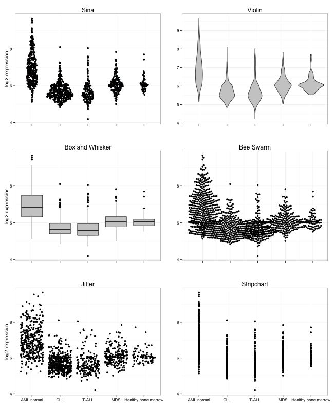

## Introduction

Recent developments in data science, in particular computational biology, often 
integrate data from several sources, over diverse experiments, or databases 
leaves a challenge of truthfully visualize data where the number of data points 
vary between classes. Plot types like bar charts, violin plot, strip charts or 
box-and-whiskers plots can provide visual information about mean/median, 
variance of the data, number of data points or density distribution of data; 
but only pairs of plots or dense overlays of these plot types will provide all 
the relevant information. To aid the presentation of datasets with differing 
sample size we have developed a new type of plot overcoming limitations of 
current standards visualization charts. 

**sinaplot** is inspired by the strip chart and the violin plot. By letting the 
normalized density of points restrict the jitter along the x-axis the plot 
displays the same contour as a violin plot, but resemble a simple strip chart 
for small number of data points. In this way the plot conveys information of 
both the number of data points, the density distribution, outliers and spread 
in a very simple, comprehensible and condensed format.

## Examples

```{r example, fig.align='center', fig.width=5, fig.height=4}
x <- c(rnorm(200, 4, 1), rnorm(200, 5, 2), rnorm(200, 6, 1.5))
groups <- c(rep("Cond1", 200), rep("Cond2", 200), rep("Cond3", 200))

library(sinaplot)
sinaplot(x, groups)
```

### Blood 

We use a cohort of 2095 AML, ALL and healthy bone marrow samples to illustrate 
some of the strengths  of **sinaplot**.

```{r blood, echo=FALSE, results='asis'}
knitr::kable(head(blood, 10))
```

---
```{r bloodDensity, fig.align='center', fig.height=6, fig.width=7}
sinaplot(blood$value, blood$type)
```

---

Using the `method = "neighbourhood"` to compute the borders we get a less smooth 
spread of the samples due to the absence of the kernel density estimate.

```{r bloodNeighb, fig.align='center', fig.height=6, fig.width=7}
sinaplot(blood$value, blood$type, method = "neighbourhood")
```

---

Setting the argument `groupwiseScale = FALSE we` turn off the relative scaling of all the 
sample types based on the one with the highest density.

```{r bloodScaleOff, fig.align='center', fig.height=6, fig.width=7}
sinaplot(blood$value, blood$type, method = "neighbourhood", 
         groupwiseScale = FALSE)
```

## Comparison

Using a subset of the ```blood``` dataset we compare sinaplot with 5 popular 
plotting strategies, and show how our package integrates features from these
methods to achieve truthful and yet simple representation of multiclass
single variable data.
    
    
## Session info

```{r sessionInfo}
sessionInfo()
```

